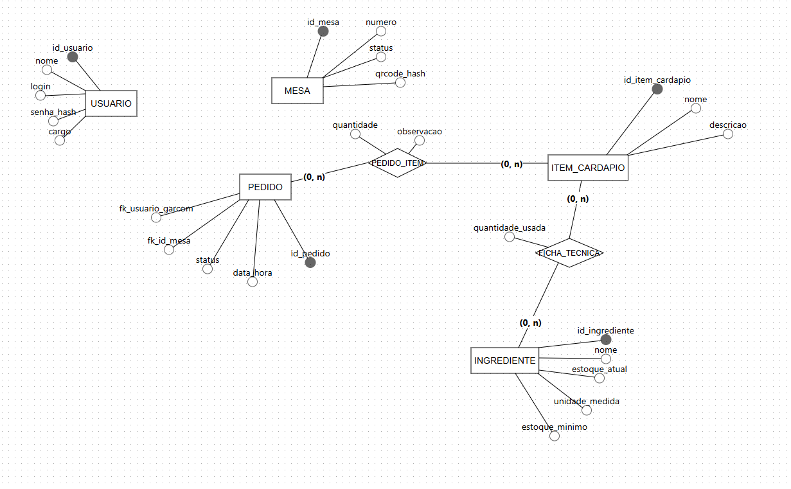

<p align="center">
  
</p>

<h1 align="center">
  Stoki - Gestão Inteligente para Restaurantes
</h1>

<p align="center">
  O sistema completo para otimizar o gerenciamento de mesas, pedidos e ingredientes de restaurantes e bares.
  <br />
  <br />
  
  
  
</p>

---

## 📋 Índice

* [Sobre o Projeto](#sobre-o-projeto)
* [✨ Funcionalidades](#funcionalidades)
* [📸 Screenshots](#screenshots)
* [🚀 Tecnologias Usadas](#tecnologias-usadas)
* [⭐ Pilares de Qualidade](#pilares-de-qualidade)
* [💭 Modelo Conceitual](#modelo-conceitual)
* [🗃️ Modelo de Dados](#modelo-de-dados)
* [🏁 Começando](#começando)
* [🤝 Como Contribuir](#como-contribuir)
---

## 🧐 Sobre o Projeto

Este projeto modela e desenvolve um sistema de gerenciamento completo para restaurantes e bares. A solução foca em otimizar a operação, integrando o atendimento ao cliente diretamente na mesa com um controle de estoque inteligente.

> **O Problema:** Erros operacionais, falta de comunicação entre salão e cozinha, e dificuldade em gerenciar o estoque de ingredientes em tempo real.
>
> **A Solução:** Um sistema centralizado que digitaliza o cardápio, automatiza pedidos, dá baixa em insumos e fornece uma visão clara da operação para os gestores.

## ✨ Funcionalidades

Nosso sistema é dividido em módulos que resolvem problemas específicos do seu negócio:

* 📱 **Cardápio Digital (RF01):** Clientes acessam o cardápio via QR Code, fazem pedidos pelo smartphone e os enviam direto para a cozinha.
* 📦 **Gestão de Estoque (RF02):** Cadastro de ingredientes, associação aos pratos (ficha técnica) e baixa automática de insumos a cada pedido.
* 🔔 **Alertas de Estoque:** Emissão de alertas automáticos quando um ingrediente atinge o estoque mínimo.
* 🖥️ **Painel Operacional (RF03):** Telas otimizadas para a cozinha (status de pedidos) e garçons (status das mesas e notificações).
* 🗺️ **Gerenciamento do Salão (RF04):** Controle visual do status das mesas (livre, ocupada, reservada) para facilitar o fluxo de clientes.
* 📊 **Módulo Administrativo (RF05):** Ferramentas para gerentes cadastrarem/alterarem itens, gerenciarem contas de funcionários e acessarem relatórios de vendas.

## 📸 Screenshots

<p align="center">
  
</p>

| Tela de Pedidos (Cliente) | Dashboard (Gerente) |
| :---: | :---: |
|  |  |


## 🚀 Tecnologias Usadas

O Stoki é construído com tecnologias modernas, escaláveis e robustas:

| Componente | Tecnologia                                                                                                                                                                                                     |
| :--- |:---------------------------------------------------------------------------------------------------------------------------------------------------------------------------------------------------------------|
| **Backend** |         |
| **Frontend** |   |
| **Banco de Dados** |                                                                                               |

## ⭐ Pilares de Qualidade

Mais do que funcionalidades, garantimos uma base sólida (Requisitos Não Funcionais):

* usability: **Usabilidade (RNF01):** Interface intuitiva para clientes (sem necessidade de aprendizado) e ágil para a equipe.
* ⚡ **Desempenho (RNF02):** Respostas rápidas, com carregamento de cardápio e envio de pedidos em menos de 2 segundos.
* 🔒 **Segurança (RNF03):** Acesso protegido por autenticação e autorização baseada em cargos.
* 📈 **Disponibilidade (RNF04):** Alta disponibilidade (99.5% de uptime) para garantir que o sistema funcione durante todo o horário de pico.
* 🌐 **Compatibilidade (RNF05):** Aplicação do cliente 100% responsiva para os principais navegadores de smartphones.

## 💭 Modelo Conceitual
<p align="center">
  
</p>

## 🗃️ Modelo de Dados

```mermaid
erDiagram
    USUARIO {
        int id_usuario PK
        string nome
        string login
        string senha_hash
        string cargo
    }

    MESA {
        int id_mesa PK
        string numero
        string status
        string qrcode_hash
    }

    PEDIDO {
        int id_pedido PK
        int fk_usuario_garcom FK "Ref. USUARIO(garçom)"
        int fk_id_mesa FK "Ref. MESA"
        string status
        datetime data_hora
    }

    ITEM_CARDAPIO {
        int id_item_cardapio PK
        string nome
        string descricao
    }

    INGREDIENTE {
        int id_ingrediente PK
        string nome
        float estoque_atual
        string unidade_medida
        float estoque_minimo
    }

    PEDIDO_ITEM {
        int fk_id_pedido FK "Ref. PEDIDO"
        int fk_id_item_cardapio FK "Ref. ITEM_CARDAPIO"
        int quantidade
        string observacao
    }

    FICHA_TECNICA {
        int fk_id_item_cardapio FK "Ref. ITEM_CARDAPIO"
        int fk_id_ingrediente FK "Ref. INGREDIENTE"
        float quantidade_usada
    }

    USUARIO ||--|{ PEDIDO : "registra"
    MESA    ||--|{ PEDIDO : "pertence a"
    PEDIDO  }|--o{ PEDIDO_ITEM : "contém"
    ITEM_CARDAPIO }|--o{ PEDIDO_ITEM : "é um"
    ITEM_CARDAPIO }|--o{ FICHA_TECNICA : "possui"
    INGREDIENTE   }|--o{ FICHA_TECNICA : "compõe"
